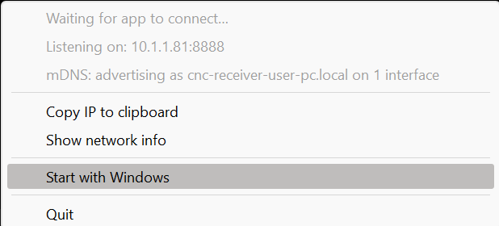
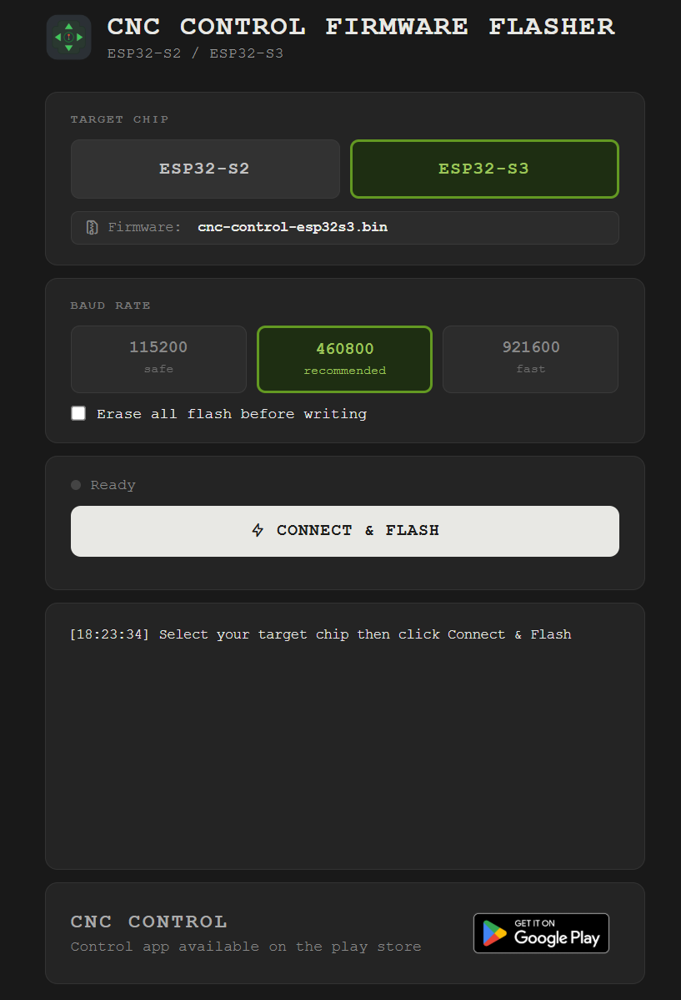
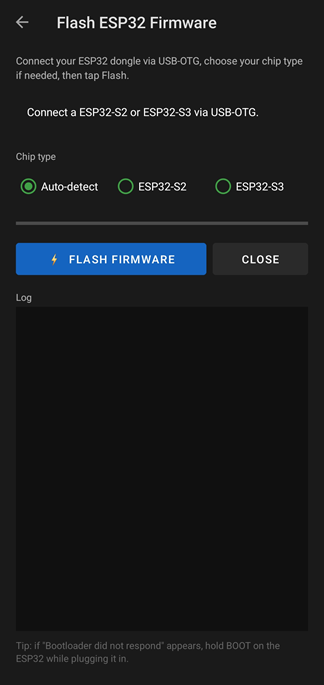
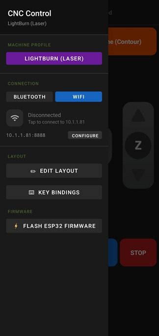
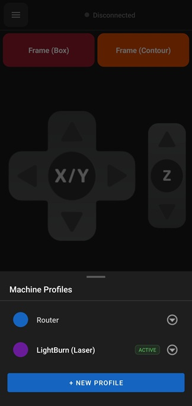
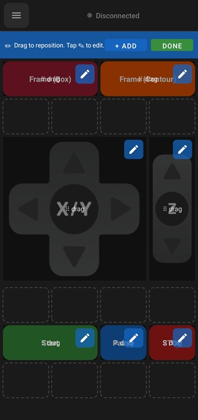
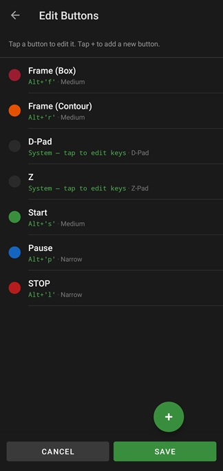
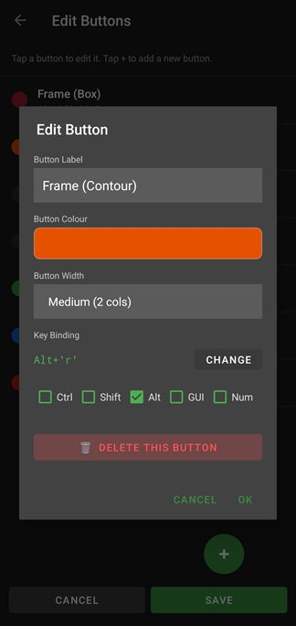

# CNC Control

> Turn a phone or tablet into a wireless jog pendant and macro pad for your CNC, laser, or router.

CNC Control sends keyboard shortcuts to your machine over the network or via a USB
keyboard emulator. To get started you set up **one** bridge between the app and your
machine — either the **Windows receiver** or an **ESP32 dongle**.

---

## Contents

- [Choose your bridge](#choose-your-bridge)
- [Option 1 — Windows Receiver](#option-1--windows-receiver)
- [Option 2 — ESP32 Dongle](#option-2--esp32-dongle)
- [Connecting & the app menu](#connecting--the-app-menu)
- [Profiles, layout & key bindings](#profiles-layout--key-bindings)
- [Troubleshooting](#troubleshooting)
- [Links](#links)

---

## Choose your bridge

The app needs something on the other end to receive its commands. Pick whichever
suits your setup — you only need one.

| | **Windows Receiver** | **ESP32 Dongle** |
|---|---|---|
| **Best for** | A machine already driven by a Windows PC | Any machine, with or without a PC |
| **Hardware** | None | ESP32-S2 or ESP32-S3 board/dongle |
| **Connection** | Wi-Fi only | Bluetooth **or** Wi-Fi |
| **How it works** | Small app on the PC receives commands over the network | Dongle emulates a USB keyboard to the machine |

---

## Option 1 — Windows Receiver

The quickest route. Download the receiver, run it, and let the app find it on your network.

### 1. Download the receiver

Grab the build that matches your Windows version:

| Build | Windows version |
|---|---|
| [`CncReceiver.zip`](https://github.com/DnG-Crafts/CNC-Control/releases/download/WIN/CncReceiver.zip) | Vista / 7 / 8 / 10 / 11 |
| [`CncReceiver.zip`](https://github.com/DnG-Crafts/CNC-Control/releases/download/WIN-XP/CncReceiver.zip) | Windows XP |

### 2. Unzip and run it

Extract the archive and launch the app. It runs in the **notification area** (system
tray, near the clock) — there's no main window.

### 3. Optional — start with Windows

Right-click the tray icon and enable **Start with Windows** so the receiver is ready
after every reboot.

  

> The tray menu shows the receiver's IP address and listening port, plus options to
> copy the IP, show network info, start with Windows, or quit.

### 4. Discover it from the app

With the receiver running, open CNC Control and find it under **Wi-Fi**.

> [!IMPORTANT]
> The PC and your phone/tablet must be on the **same Wi-Fi network** for discovery to work.

---

## Option 2 — ESP32 Dongle

For the hardware route you need an **ESP32-S2** or **ESP32-S3** board or dongle. It
emulates a real USB keyboard to the target machine, then talks to your phone over
**Bluetooth or Wi-Fi**.

### Step 1 — Flash the firmware (pick one method)

<table>
<tr>
<th>Option A — Manual</th>
<th>Option B — Browser</th>
<th>Option C — In-app</th>
</tr>
<tr>
<td valign="top">

Download the firmware binary and flash it with your own tool.

[Firmware release →](https://github.com/DnG-Crafts/CNC-Control/releases/tag/ESP32)

</td>
<td valign="top">

Flash straight from a Chrome-based browser over USB — no install.

[Web flasher →](https://d-n-g.github.io/flasher.html)

</td>
<td valign="top">

Plug the ESP32 into your phone/tablet (USB-OTG) and flash from CNC Control itself.

`Menu → Flash ESP32 Firmware`

</td>
</tr>
</table>

  
  &nbsp;&nbsp;
  

Left: the browser flasher (Option B). &nbsp; Right: flashing inside the app (Option C).

Leave the chip selection on **Auto-detect** unless flashing fails, then pick your exact
board (ESP32-S2 or ESP32-S3).

### Step 2 — Plug it into the machine

Once the firmware is on the ESP32, disconnect it from the flashing source and plug it
into your **target machine**.

### Step 3 — Connect from the app

Open CNC Control and connect to the dongle over **Bluetooth** or **Wi-Fi**.

---

## Connecting & the app menu

However you bridged in, the **app menu** is mission control — connection, machine
profiles, layout and firmware all live here.

  

1. **Open the menu** — tap the menu icon (top-left). Every setting lives here.
2. **Pick your connection type** — choose how to connect, then tap the connection row
   to link up. The **Windows receiver is Wi-Fi only**; an **ESP32 dongle** can use
   Bluetooth or Wi-Fi. **Configure** lets you set the IP and port manually.
3. **Jump to setup tools** — from here you reach **Edit Layout**, **Key Bindings**, and
   **Flash ESP32 Firmware**.

---

## Profiles, layout & key bindings

Build a control surface for each machine: create profiles, drag buttons into place, and
map each one to the keyboard shortcut your software expects.

### Create machine profiles

Add a profile per machine and switch between them — the active profile drives the
buttons you see. Tap **+ New Profile** to add one, or select an existing profile to edit
or remove it.

  

### Edit the main layout

Enter edit mode to **drag buttons to reposition** them on the grid, resize them, and tap
the pencil to edit. Use **+ Add** for new buttons and **Done** when finished.

  

### Edit key bindings & buttons

Open the button list to add or remove buttons and see each one's key binding at a
glance — e.g. `Alt+F` for Frame, `Alt+S` for Start, `Alt+L` for Stop.

  

### Tune a single button

Tap a button to set its **label**, **colour** and **width**, and to define the exact
**key binding** — including modifiers like `Ctrl`, `Shift`, `Alt`, `GUI` and `Num`.

  

> [!TIP]
> Pick a binding that matches a shortcut your CNC/laser software already responds to,
> save the button, hit **Done**, and the new control is live on your pendant.

---

## Troubleshooting

| Problem | Fix |
|---|---|
| App can't find the Windows receiver | Make sure the receiver is running and the PC and phone are on the **same Wi-Fi network**. |
| `Bootloader did not respond` while flashing | Hold the **BOOT** button on the ESP32 while plugging it in, then flash again. |
| Flashing fails on auto-detect | Manually select your exact chip (**ESP32-S2** or **ESP32-S3**) in the flasher. |
| Wrong keys sent to the machine | Check the button's key binding and modifiers match the shortcut your CNC/laser software expects. |

---

## Links

- **Android app:** https://play.google.com/store/apps/details?id=dngsoftware.cnccontrol&hl=en
- **Windows receiver (Vista–11):** https://github.com/DnG-Crafts/CNC-Control/releases/download/WIN/CncReceiver.zip
- **Windows receiver (XP):** https://github.com/DnG-Crafts/CNC-Control/releases/download/WIN-XP/CncReceiver.zip
- **ESP32 firmware:** https://github.com/DnG-Crafts/CNC-Control/releases/tag/ESP32
- **Web flasher:** https://d-n-g.github.io/flasher.html
